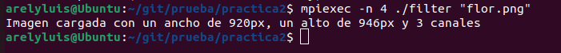
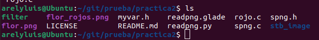
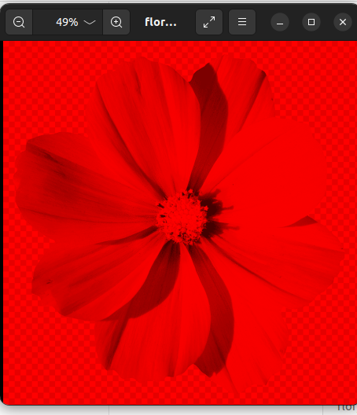
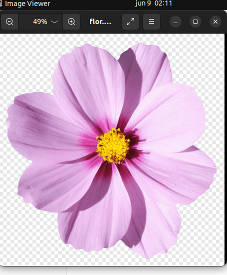

## Practice 2


## Description

High Performance Computing Class Practice 2

Create a filter that performs a color transformation that works in parallel with MPICH.

## Execution

Clone the repository:


```text
git clone https://github.com/areelu/practica2.git
```
Compile the rojo.c file:

```text
mpicc \-o filter rojo.c -lm
```
Run the compiled file:

```text
mpiexec -n 4 ./filter "flor.png"
```
If all goes well, it will give us the following results:



In the folder where the files are executed, an image with the filter applied will be created. In this case 'flor_rojos.png'.



## Results





# Requirements:
mpi 
spng

